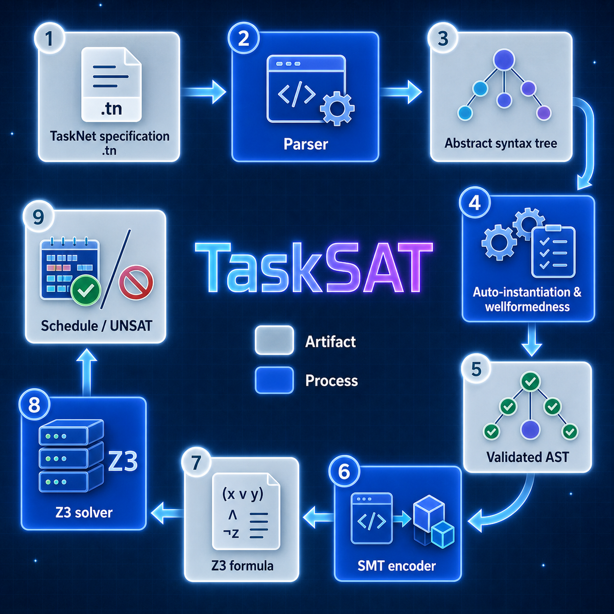

# TaskSAT 

TaskSAT is a domain-specific language and tool for modeling and verifying task scheduling problems with rich temporal and resource constraints. The system combines a declarative specification language with SMT-based automated reasoning using Z3. TaskSAT supports multiple types of state variables that model discrete states, Boolean flags, and continuous resources with complex dynamics including rate-based evolution. Tasks specify preconditions, invariants, postconditions, and resource impacts (assignments, deltas, cumulative rates, rate assignments) that occur at boundaries or during execution. The verifier encodes specifications into quantifier-free SMT formulas using zone-based time discretization, supporting both satisfiability checking and optimization. Users can express temporal properties using LTL-style operators (always, eventually, until, since) that are verified alongside scheduling constraints.

TaskSAT can be applied to scheduling problems in autonomous systems, such as spacecraft and rover operations.

## Key Features

- **Auto-instantiation**: Automatically creates task instances from taskdefs when type-level dependencies exist, reducing manual specification (e.g., 2 downlinks → 6 tasks total with thermal management)
- **Sequence construct**: Concise syntax for sequential task ordering - `sequence [t1, t2, t3]` desugars to pairwise constraints
- **Automatic visualization**: Gantt charts, timelines, and JSON schedules generated automatically during verification
- **Web UI**: Browse tasknets, view schedules, UNSAT core analysis with raw SMT formulas, console output display, bulk deletion
- **Property verification**: Comprehensive error traces for violated temporal properties with violation zone identification
- **Rich state modeling**: Rate-based continuous resources, discrete states, Boolean flags
- **Temporal logic**: LTL-style properties (always, eventually, until, since) for verification
- **Zone-based encoding**: Efficient SMT encoding using time discretization at task boundaries
- **Optimization**: Find schedules that minimize/maximize objectives (battery usage, priority-weighted completion)
- **MEXEC semantics**: Based on JPL's MEXEC scheduling system

## System Architecture

<p align="center">
  
</p>

<sub>Diagram source: [`doc/architecture.dot`](doc/architecture.dot). Regenerate with `dot -Tpng -Gdpi=150 doc/architecture.dot -o doc/architecture.png`.</sub>

## Generated Files

TaskSAT organizes all generated files under `.tasksat/` directories:

```
project/
  tasknet.tn
  .tasksat/
    transformed/      # Auto-instantiated tasknets (written automatically when auto-instantiation occurs)
    schedules/        # Generated schedules and visualizations
      <tasknet_name>/
        <timestamp>/  # e.g., 2026-06-10_14-30-15
          metadata.json       # Verification metadata
          schedule.json       # Valid schedule
          timeline.json       # Timeline evolution
          gantt.png           # Gantt chart
          timeline.png        # Timeline visualization
          properties.json     # Property verification results
          unsat_core.json     # UNSAT core analysis (if UNSAT)
          console_output.txt  # Full console output
          errors/             # Error traces for violated properties
            <prop>_schedule.json
            <prop>_timeline.json
            <prop>_timeline.png
```

The `.tasksat/` directory is automatically added to `.gitignore`.

**Transformed tasknets:** When the SMT-based verifier auto-instantiates task instances from taskdefs, it automatically writes the expanded tasknet to `.tasksat/transformed/<filename>_transformed.tn`. This makes it easy to inspect what tasks were created. Use `--transform-only` to generate this file without running verification.

**Web UI:** Start the web interface to browse verification results:
```bash
./start_web.sh
# Open browser to http://localhost:5001
```

The web UI provides:
- Browse all verification results with status indicators
- View Gantt charts and timeline visualizations
- **UNSAT core analysis** with three levels:
  1. Human-readable conflict explanations and suggestions
  2. TaskSAT constraint labels
  3. Raw Z3 SMT formulas (S-expressions)
- **Console output** - Full verifier text output
- Property verification results with error traces
- Open, create, and verify tasknets directly in the browser (edits are saved back to the original file)
- Add a `.tn` file to the list without running it, and cancel a running verification
- **Bulk deletion** of verification reports (source files preserved)
## Running Examples in this Document

All examples in this document are organized in 

```
tests/tasknet_files/examples.
```

Users can run any example, say `rover1.py` in this documentation as folows:

```
python src/smt/tasknet_verifier.py tests/tasknet_files/examples/rover1.tn --mode satisfy
```

If `--mode ...` is left out it will run in the default `optimize` mode.

## The Role of MEXEC

TaskSAT was created in order to explore an alternative method for analysing and verifying tasknets, which form the inputs to JPL's  [MEXEC](https://ai.jpl.nasa.gov/public/projects/mexec/) scheduling system. The constructs of the TaskSAT language are designed as close as possible to the MEXEC tasknet "concepts", with a semantics as close as possible to the perceived semantics of MEXEC tasknets. However, it is not a precise match since (a) on occasions the exact semantics of MEXEC has not been clear to us, (b) we have added some new language features, most importantly temporal logic constraints, (c) the scheduling algorithm is different, based on constraint solving, (d) we have added a verification step, and finally (e) we defined a DSL (Domain-Specific Langauge) for defining tasknets.

## Documentation

Full documentation is published at **[nasa-jpl.github.io/tasksat](https://nasa-jpl.github.io/tasksat/)**.

- **[Getting Started](https://nasa-jpl.github.io/tasksat/docs/getting-started)** - Quick installation and your first TaskNet in minutes
- **[Tutorial](https://nasa-jpl.github.io/tasksat/docs/tutorial)** - In-depth walkthrough of concepts using an example
- **[Manual](https://nasa-jpl.github.io/tasksat/docs/manual)** - Complete language reference
- **[Grammar](https://nasa-jpl.github.io/tasksat/docs/grammar)** - Formal grammar and syntax reference
- **[Theory](https://nasa-jpl.github.io/tasksat/docs/smt-encoding)** - Theory behind SMT encoding

The docs source lives in [`website/docs/`](website/docs/) and is built with [Docusaurus](https://docusaurus.io/).


## License, Copyright, Permissions, Disclaimer

APACHE LICENSE, VERSION 2.0: https://www.apache.org/licenses/LICENSE-2.0.txt

Copyright 2026, by the California Institute of Technology. ALL RIGHTS RESERVED. United States Government Sponsorship acknowledged. Any commercial use must be negotiated with the Office of Technology Transfer at the California Institute of Technology.
 
This software may be subject to U.S. export control laws. By accepting this software, the user agrees to comply with all applicable U.S. export laws and regulations. User has the responsibility to obtain export licenses, or other export authority as may be required before exporting such information to foreign countries or providing access to foreign persons.

-  Redistributions of source code must retain the above copyright notice, this list of conditions and the following disclaimer. 
- Redistributions in binary form must reproduce the above copyright notice, this list of conditions and the following disclaimer in the documentation and/or other materials provided with the distribution. 
- Neither the name of Caltech nor its operating division, the Jet Propulsion Laboratory, nor the names of its contributors may be used to endorse or promote products derived from this software without specific prior written permission. 

THIS SOFTWARE IS PROVIDED BY THE COPYRIGHT HOLDERS AND CONTRIBUTORS "AS IS" AND ANY EXPRESS OR IMPLIED WARRANTIES, INCLUDING, BUT NOT LIMITED TO, THE IMPLIED WARRANTIES OF MERCHANTABILITY AND FITNESS FOR A PARTICULAR PURPOSE ARE DISCLAIMED. IN NO EVENT SHALL THE COPYRIGHT OWNER OR CONTRIBUTORS BE LIABLE FOR ANY DIRECT, INDIRECT, INCIDENTAL, SPECIAL, EXEMPLARY, OR CONSEQUENTIAL DAMAGES (INCLUDING, BUT NOT LIMITED TO, PROCUREMENT OF SUBSTITUTE GOODS OR SERVICES; LOSS OF USE, DATA, OR PROFITS; OR BUSINESS INTERRUPTION) HOWEVER CAUSED AND ON ANY THEORY OF LIABILITY, WHETHER IN CONTRACT, STRICT LIABILITY, OR TORT (INCLUDING NEGLIGENCE OR OTHERWISE) ARISING IN ANY WAY OUT OF THE USE OF THIS SOFTWARE, EVEN IF ADVISED OF THE POSSIBILITY OF SUCH DAMAGE. 

## Contribution

- Klaus Havelund <klaus.havelund@jpl.nasa.gov>
- Alessandro Pinto <alessandro.pinto@jpl.nasa.gov>

TaskSAT has been developed with substantial assistance from large language
models (a practice colloquially known as "vibe coding"): the authors directed
the design, review, and validation, while much of the implementation was carried
out through AI-assisted, agentic coding workflows.
